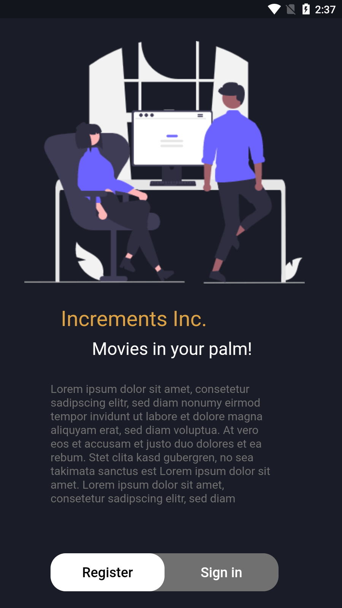
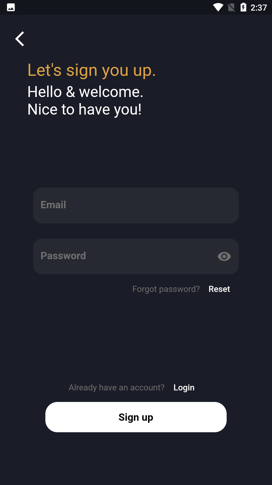
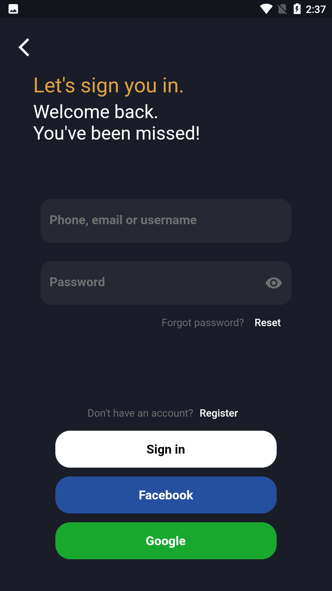
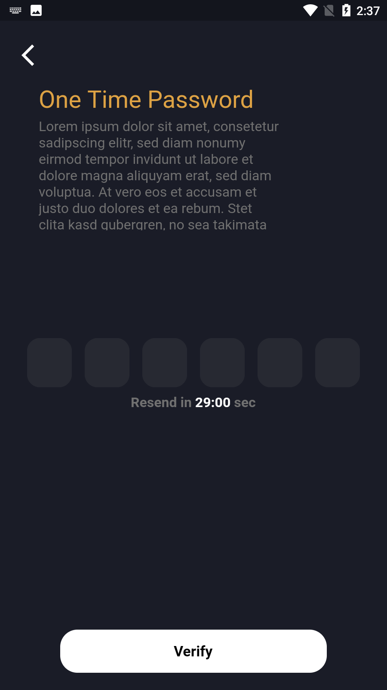
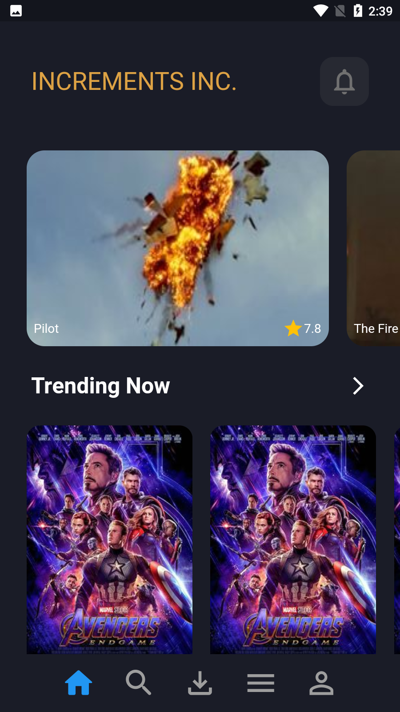
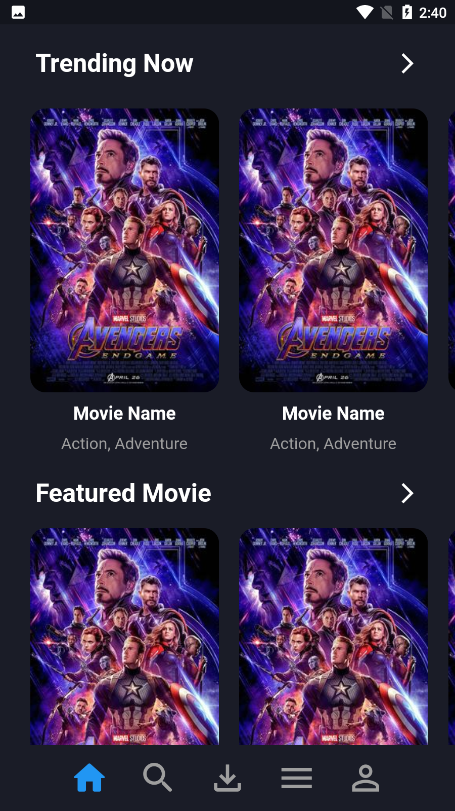
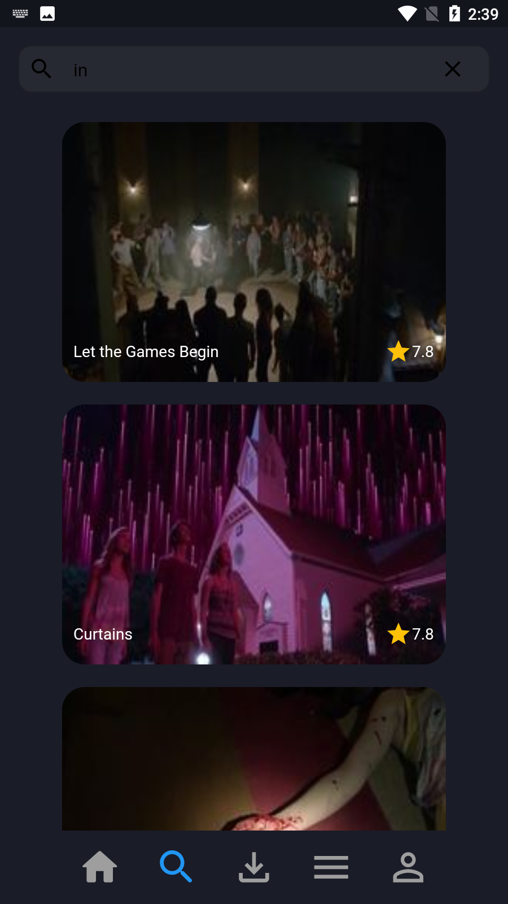
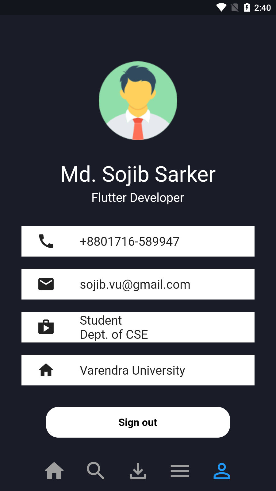

# Movie App

Movies at you palm!

## About the project

This project is the test assignment given by Increments Inc. for the position of the Flutter Developer. 
In this project, you can find tons of movies provided by one of the Rapid API services. 

### Key Features:
1. Firebase Email Authentication System.
2. Firebase Google Authentication System.
3. Firebase Phone Number Authentication System.
4. Firebase Facebook Authentication System.
5. OTP Verification System for Firebase Phone No. Auth. System.
6. Firebase Push Notification System.
7. Profile Page for sign out and user information.
8. Dynamic UI Design.
9. Live search.
These are the major features included in this project. 
### Output Screens:
Introduction Screen        |  Registration Screen     |
:-------------------------:|:-------------------------:|
  |    |

 

Login Screen        |  OTP Verification Screen     |
:-------------------------:|:-------------------------:|
  |    |

 

Home Screen        |  Home Screen (cont.)     |
:-------------------------:|:-------------------------:|
  |    |

 

Live Search Screen        |  User Profile Screen     |
:-------------------------:|:-------------------------:|
  |    |

 
